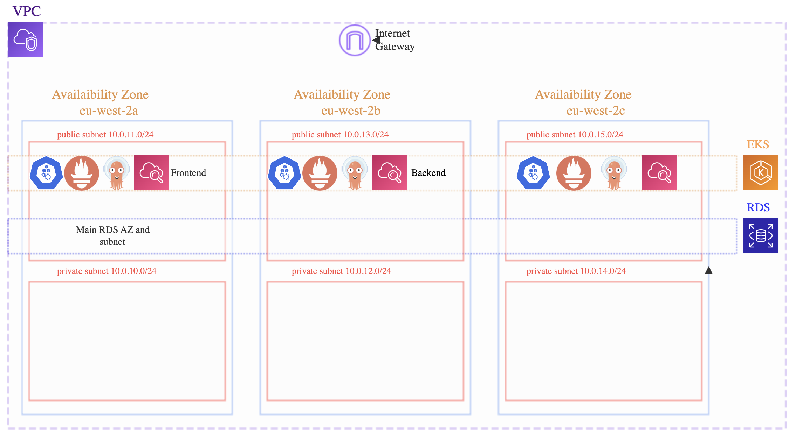

<h1 align="center">
  <br>
  </a>
</h1>

<h1 align="center">
Infrastructure Deployment with CI/CD
</h1>


<p align="center">
  <a href="https://aws.amazon.com/">
    
  </a>
  <a href="https://www.terraform.io/"></a>
  <a href="https://kubernetes.io/">
      
  </a>
  <a href="https://circleci.com/">
    
  </a>
    <a href="https://www.postgresql.org/">
    
  </a>
    </a>
    <a href="https://prometheus.io/">
    
  </a>
    </a>
    <a href="https://grafana.com/">
    
  </a>
      </a>
    <a href="https://argo-cd.readthedocs.io/en">
    
  </a>
      </a>
    <a href="https://argo-cd.readthedocs.io/en">
    
  </a>

</p>

<p align="center">
  <a href="#overview">Overview</a> •
  <a href="#components-deployed">Components Deployed</a> •
  <a href="#directories-and-file-structure">Directories and File Structure</a> •
  <a href="#usage">Usage</a> •
  <a href="#troubleshooting">Troubleshooting</a>
</p>


### by AWSome Architechs 

## Overview

This group project builds and manages a cloud-based infrastructure for a learner management system. DevOps practices were continuously integrated into the creation of this project to enhance the scalability and efficiency of the infrastructure and all for continual adaption. 


<h1 align="center">
  <br>
</a>
</h1>


* Infrastructure as Code (IaC): Creating the infrastructure with Terraform allowed for the automation of the infrastructure setup
* CI/CD Pipeline: The use of CircleCI and ArgoCD created a seamless, automated pipeline for continuous integration and delivery, streamlining the development process.


#### Feedback 
* Monitoring and Alerting: Implemented Prometheus and Grafana for comprehensive monitoring, facilitating real-time feedback on system performance and health.
* Logging: Utilised AWS CloudWatch for detailed logging, offering crucial insights and feedback on the application's operational aspects.


#### Continual Learning
* Our project leveraged Docker, Kubernetes, and EKS on AWS, utilizing Helm charts for streamlined management. We explored CircleCI for Continuous Integration, Argo CD for Continuous Deployment, and compared Jenkins with CircleCI. Additionally, we experimented with Pulumi, an infrastructure as code tool, to assess its benefits and distinctions from Terraform.


## Components Deployed 
Below is an overview of the key components this infrastructure deploys:

* Virtual Private Cloud (VPC): Established a secure and isolated network environment within AWS.
* Security Groups: Configured to manage and control inbound and outbound traffic for enhanced security.
* NAT and Internet Gateways: Facilitated secure and efficient internet connectivity for our network.
* RDS (Relational Database Service): Set up a managed database service for efficient data storage and retrieval.
* EKS (Elastic Kubernetes Service): Created a managed Kubernetes service for deploying and scaling our containerized applications.

## Directories and File Structure

Our project's infrastructure is structured into several modules, each responsible for creating specific components:

* Networking Module: Creates the VPC, defining public and private subnets and setting up the necessary networking components for the project, such as a NAT gateway and internet gateway. It also configures the availability zones for high availability.

* EKS Module: Establishes the Elastic Kubernetes Service, which includes setting up the EKS cluster with auto-scaling capabilities and integrating it with the defined subnets and security groups.

* Security Module: Responsible for creating security groups that dictate the traffic flow to and from the services running in our VPC, ensuring a secure network environment.

* Database Module: Sets up the AWS RDS instance.

Each module's directory contains Terraform files (main.tf, variables.tf, outputs.tf, etc.) that define and configure the respective resources, ensuring modularity and ease of maintenance in our infrastructure setup.

#### Kubernetes Deployment Directory 
* Backend Deployment: Defines the state of the backend application pods. It specifies the Docker image to be used, the number of replicas, and the container port (8080) for the application. Configures the backend service, exposing it through a LoadBalancer. It integrates with Prometheus for monitoring, specifying the metrics port and enabling scraping.
* Frontend Deployment:  Sets up the frontend application pods, detailing the image to be used, the desired number of replicas, and the container port (80). Defines the service for the frontend, making it accessible via a LoadBalancer. It listens on port 3008 and directs traffic to the container's port 80.
* Service Monitor: Used for monitoring the backend service with Prometheus. It specifies the scraping interval, timeout, and the metrics path (/actuator/prometheus) for Prometheus to collect metrics.

## Usage 

### Continuous Integration
The [frontend](https://github.com/ggrady00/ce-team-project-frontend) and [backend](https://github.com/ggrady00/ce-team-project-backend) repo are all setup for usage with CircleCI and will build and push an image to AWS-ECR.
In the build-image-and-push job the repo and public registry alias need to be changed in order to push to your own ECR repo.
#### **Changes needed when building images:**
#### **Frontend CI configuration:**
***Enviroment Variable:***
<br> In the **'.env file'**, set the **'VITE_API_BASE_URL'** to the Backend Loadbalancer DNS.
```
VITE_API_BASE_URL = backend-endpoint:8080
```

In the db/migration/application.yml file:
Configure the YAML file to migrate the backend database to an RDS Postgres instance.
Update the datasource URL with your own RDS endpoint, port, and database name.

#### **Backend CI configuration:**
***Database Migration Configuration:***
In the db/migration/application.yml file:
- Configure the YAML file to migrate the backend database to an RDS Postgres instance.
- Update the datasource URL with your own RDS endpoint, port, and database name.
 
 ```bash 
 datasource:
  url: jdbc:postgresql://your-rds-endpoint:your-port/your-database-name
 ```
> **Note**
<br> In the CircleCI job named build-image-and-push, ensure to modify the repository and public registry alias to match your ECR repository. This ensures that the Docker images are pushed to your specific ECR repository.

These configurations should be adapted to match your specific environment and requirements.
### Continuous Deployment

Utilize ArgoCD for automated synchronization with your project's repository, specifying deployment file paths, target cluster, and namespace in the dashboard. 

After setup, Argo CD deploys your application automatically based on repository commits, continually monitoring for changes. Easily manage and visualize application health, manually syncing changes if required.

### Deploying Backend, Frontend, and Monitoring Apps with Helm and ArgoCD

This guide will walk you through deploying the backend, frontend, and monitoring applications on your AWS EKS cluster using Helm charts and ArgoCD. ArgoCD is a declarative, GitOps continuous delivery tool for Kubernetes.

#### Prerequisites

    • AWS EKS cluster set up with ArgoCD installed.
    • Helm CLI installed on your local machine.
    • AWS CLI configured with the necessary permissions.

#### Helm Charts Structure
The Helm charts are organized into a directory structure with the following key files:

    • Chart.yaml: Metadata about the Helm chart.
    • values.yaml: Customizable values for the backend and frontend applications.
    • templates/: Kubernetes YAML templates for Frontend, Backend and ServiceMonitors deployments and services

#### Deployment Steps
##### 1. Clone the repository


```bash
# Clone this repository
$ git clone https://github.com/AnamariaGM/ce-team-project

# Go into the directory
$ cd my-aws-helm-chart
```
##### 2. Customizing Values


> **Note**
<br> Before deploying the applications, customize the values.yaml file to suit your requirements. This file allows you to set parameters such as container images, service types, and ports.

#### values.yaml
```
backend:
  image: public.ecr.aws/m6p2m6g2/backend:20
  service:
    type: LoadBalancer
    port: 8080

frontend:
  image: public.ecr.aws/m6p2m6g2/frontend:20
  service:
    type: LoadBalancer
    port: 80
``````

##### 3.Deploying with ArgoCD

1. Open a terminal and ensure you are in the root directory of the Helm charts.
2. Package the Helm chart:
```bash
helm package .
```
3. Deploy the Helm chart using ArgoCD. Replace <YOUR-RELEASE-NAME> with your desired release name.
```bash 
helm install <YOUR-RELEASE-NAME> ./my-aws-app-chart
```
4. Access ArgoCD UI to monitor the deployment:
```bash
kubectl port-forward svc/argocd-server -n argocd 8080:443
```
Open http://localhost:8080 in your web browser and log in with the ArgoCD credentials.


## Trouble Shooting

* Check nodes for pod utilisation, each node can hold 11 pods and if this maximum is reached you will need to configure additional pods in either the AWS management console or the Terraform code. If you are editing the Terraform code, you will need to delete your tf.state file and re-apply Terraform after configuring your maximum and desired node sizes. This is due to a bug with Terraform, where the desired size cannot be edited after a Terraform apply command has been used. This will not be solved by destroying and re-applying the terraform code, as the tf.state file will point to the original chosen desired node size.
* Ensure RDS database is configured with the username "postgres", changes to this username can result in unexpected behaviour in PgAdmin.

## Collaborators